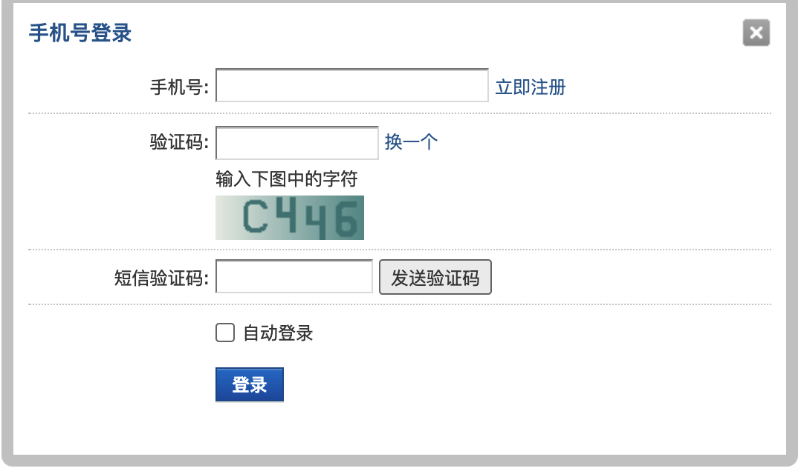
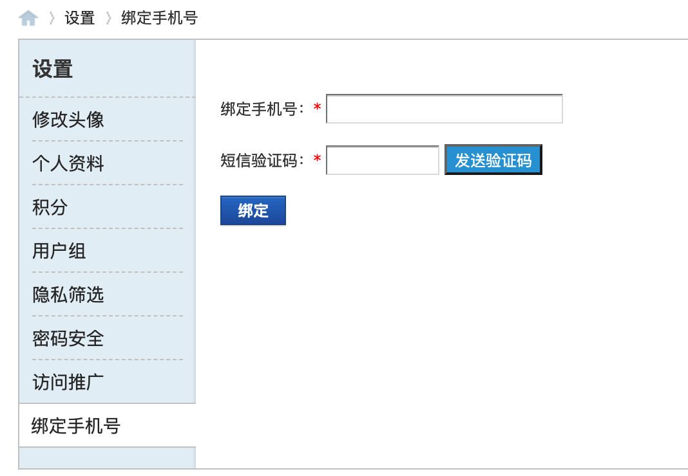
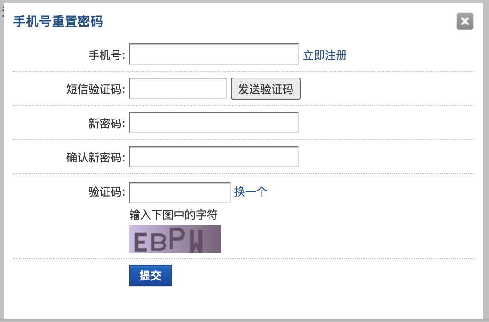
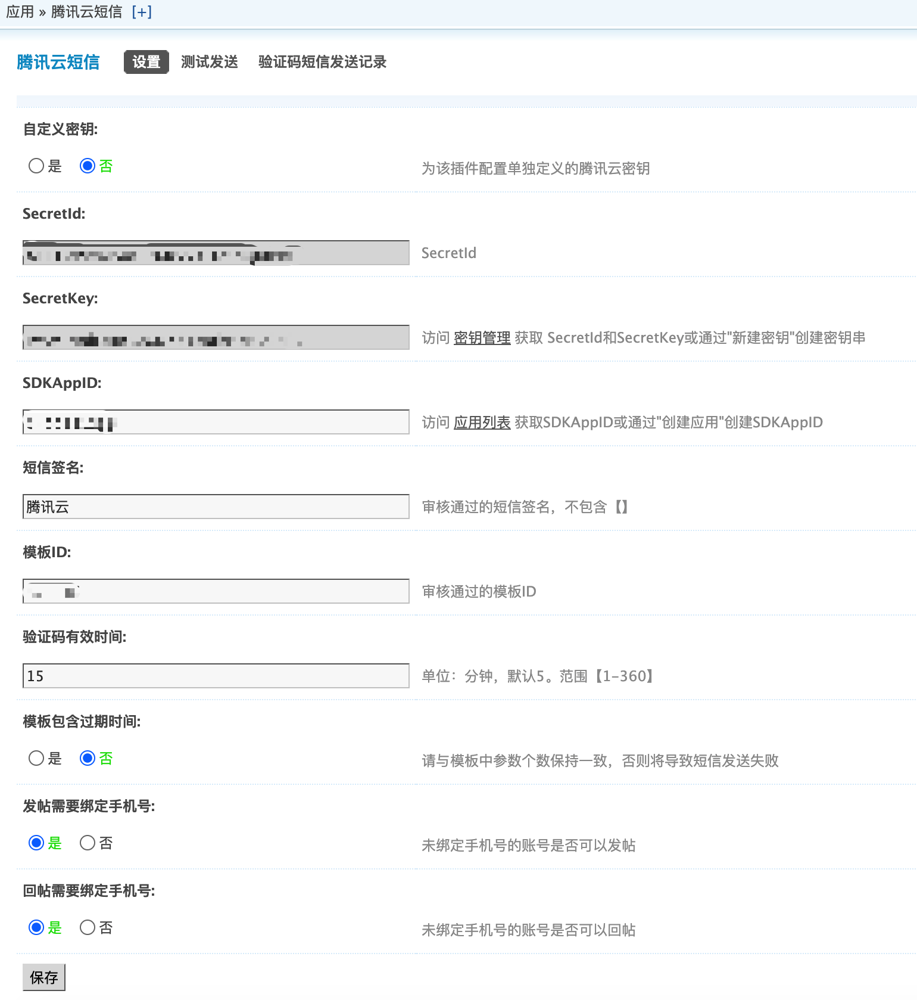
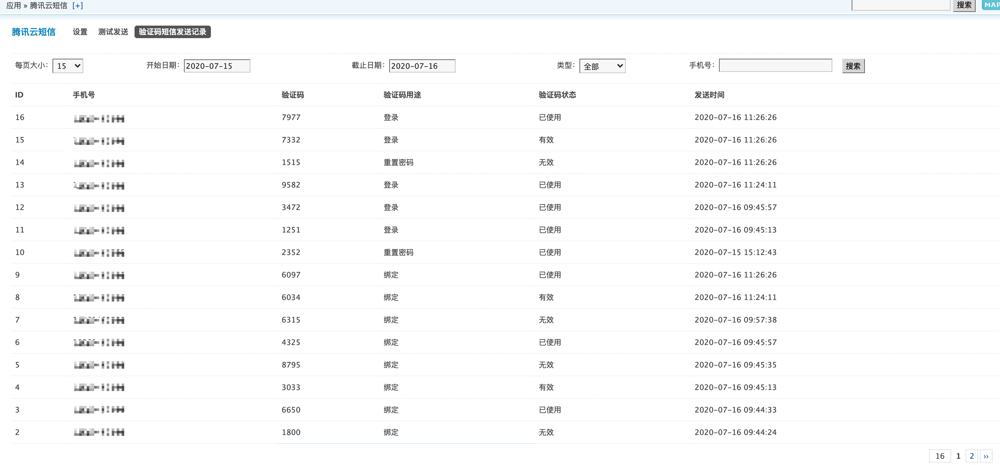

# 腾讯云短信插件

## 1.插件介绍
> tencentcloud_sms插件是一款腾讯云研发的，提供给DiscuzX站长使用的官方插件。使DiscuzX支持手机号登录,通过手机号+短信验证码找回密码等功能

| 标题       | 内容                                                         |
| ---------- | ------------------------------------------------------------ |
| 中文名称     | 腾讯云短信（SMS）插件                                         |
| 英文名称   | tencentcloud_sms                                       |
| 最新版本   | v1.0.0 (2020.06.30)                                           |
| 适用平台 | [Discuz! X](https://www.discuz.net/forum.php) |
| 适用产品 | [腾讯云短信（SMS）](https://cloud.tencent.com/product/sms)      |
| 文档中心   | [春雨文档中心](https://openapp.qq.com/docs/DiscuzX/sms.html) |
| 主创团队   | 腾讯云中小企业产品中心（SMB Product Center of Tencent Cloud）     |

## 2.功能特性

- 支持在个人资料页绑定手机号
- 通过手机号/验证码登陆站点。
- 支持发贴/回帖前验证是否绑定了手机号码。
- 支持通过短信重置用户密码。
- 支持后台查询过往短信的发送记录。

## 3.安装指引

### 3.1.部署方式一：通过GitHub部署安装

> 1. git clone https://github.com/Tencent-Cloud-Plugins/tencentcloud-discuzx-plugin-sms.git
> 2. 复制 tencentcloud_sms文件夹 到Discuz安装路径/source/plugins/文件夹里面

## 4.使用指引

### 4.1.界面功能介绍

> 未绑定手机号的用户登录后将展现提示

> 选择使用手机号的登录框

> 个人设置页新增绑定手机号菜单页

> 选择使用手机号找回密码的操作框输入

> 后台配置页面。配置介绍请参考下方的[名词解释](#_4-2-名词解释)

> 后台短信发送记录页

### 4.2.名词解释
- **自定义密钥：** 插件提供统一密钥管理，既可在多个腾讯云插件之间共享SecretId和SecretKey，也可为插件配置单独定义的腾讯云密钥。
- **Secret ID：** 在[腾讯云API密钥管理](https://console.cloud.tencent.com/cam/capi)上申请的标识身份的 SecretId。
- **Secret Key：** 在[腾讯云API密钥管理](https://console.cloud.tencent.com/cam/capi)上申请的与SecretId对应的SecretKey。
- **SDKAppID：** 在[腾讯云短信应用管理](https://console.cloud.tencent.com/smsv2/app-manage)上创建到应用ID。
- **短信签名：** 在[腾讯云短信签名管理](https://console.cloud.tencent.com/smsv2/csms-sign)审核通过的短信签名，不包含【】。
- **模板ID：** 在[腾讯云短信正文模板管理](https://console.cloud.tencent.com/smsv2/csms-template)审核通过的模板ID。

## 5.获取入口

| 插件入口          | 链接                                                         |
| ----------------- | ------------------------------------------------------------ |
| GitHub            |  [link](https://github.com/Tencent-Cloud-Plugins/tencentcloud-discuzx-plugin-sms)  |

## 6.FAQ

> 暂无

## 7.GitHub版本迭代记录

### 7.1 tencentcloud-discuzx-plugin-sms v1.0.0
- 支持在个人资料页绑定手机号
- 通过手机号/验证码登陆站点。
- 支持发贴/回帖前验证是否绑定了手机号码。
- 支持通过短信重置用户密码。
- 支持后台查询过往短信的发送记录。

---
本项目由腾讯云中小企业产品中心建设和维护，了解与该插件使用相关的更多信息，请访问[春雨文档中心](https://openapp.qq.com/docs/DiscuzX/sms.html) 

请通过[咨询建议](https://support.qq.com/products/164613) 向我们提交宝贵意见。
